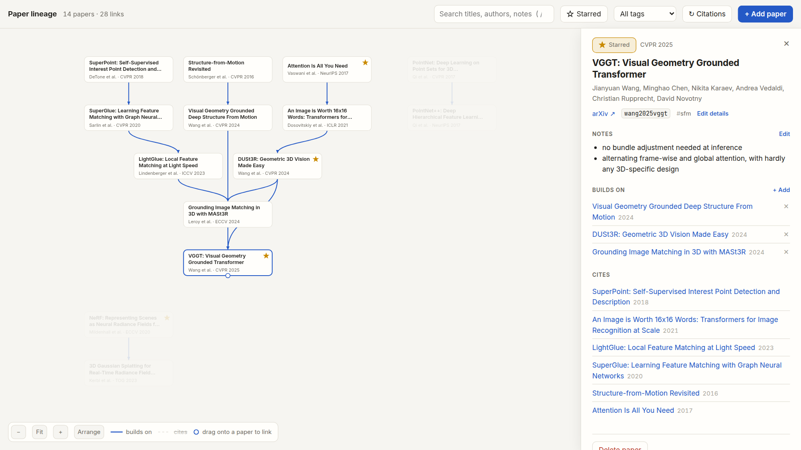
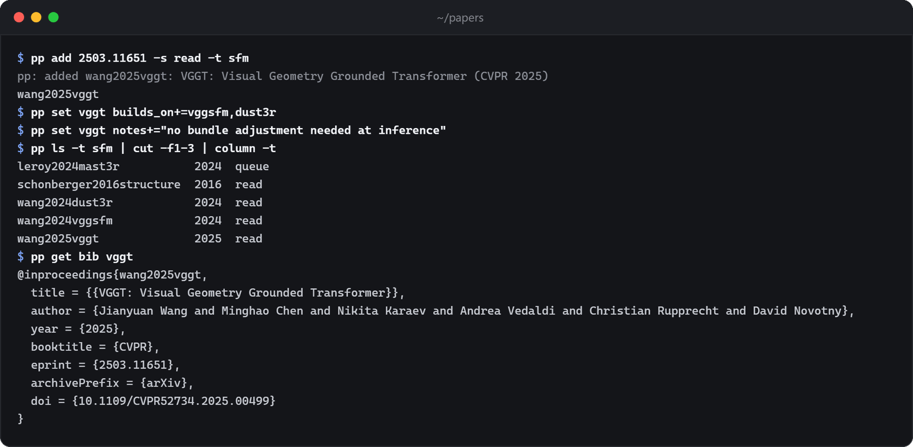

# pp

A paper library in plain text.

- **One paper, one Markdown file.** Metadata on top, your notes below. Read it with `cat`, search it with `grep`, keep it in `git`.
- **Unix.** Small commands that print plain text and compose with pipes. One Python file, no dependencies, no database, no account.
- **Made for agents.** The files and the commands are the whole interface, so Claude Code or any agent with a shell can keep the library for you.

<picture>
  <source media="(prefers-color-scheme: dark)" srcset=".github/lineage-dark.png">
  
</picture>

## Features

- Add papers by arXiv id, DOI, URL or title. Metadata comes from arXiv, Semantic Scholar and Crossref, never from memory.
- Notes are yours. They sit under the metadata with tags and a star, and your agent leaves them alone unless you ask.
- Citations between your papers are fetched for you. `builds_on` links record your own view of where an idea came from.
- A local lineage page lays each line of work out as generations of ideas, side by side; Arrange tidies it again after you drag cards around. Star papers, edit notes and details in place, and drag one card onto another to link them.
- BibTeX for any set of papers.

## Install

Needs Python 3.9 or newer.

```sh
git clone https://github.com/LarryLiZimo/pp-papers ~/.local/share/pp-papers
ln -s ~/.local/share/pp-papers/pp ~/.local/bin/pp
```

On Windows, clone anywhere and add the folder to `PATH`. Papers go to `~/papers`; set `PP_DIR` to use another folder. For Claude Code, copy `SKILL.md` to `~/.claude/skills/pp/`.

Or paste this into your agent:

```text
Install pp (https://github.com/LarryLiZimo/pp-papers), a plain-text paper library, on this machine.

1. Make sure Python 3.9 or newer is installed.
2. Clone the repo to ~/.local/share/pp-papers (Windows: %USERPROFILE%\pp-papers), or git pull it
   if it is already there.
3. Put pp on my PATH for new terminals: on macOS/Linux, symlink <clone>/pp into ~/.local/bin and
   make sure that folder is on PATH; on Windows, add the clone folder to my user PATH.
4. Ask me where my library should live. ~/papers is the default; for any other folder, set
   PP_DIR persistently.
5. If you are Claude Code, copy <clone>/SKILL.md to ~/.claude/skills/pp/SKILL.md. Other agents:
   add its rules to your persistent instructions.
6. Verify: python test.py in the clone, then pp --version (by full path if your shell does not
   see the new PATH yet).

Tell me before you change PATH, environment variables or shell startup files, and finish with a
short summary of what you changed.
```

## Usage



| Command | Does |
|---|---|
| `pp add <id>... [-s] [-t tags]` | add papers by arXiv id, DOI, URL or title; `-s` stars them |
| `pp ls [-s] [-t tag]` | list papers; `-s` lists only starred ones |
| `pp get <field> [key...]` | print `path`, `bib`, `url`, `notes` or any field; all papers if no key |
| `pp set <key> field=value...` | `star=true`, `tags+=a,b`, `notes+=...`, `builds_on+=<key>` |
| `pp mv <key> <new-key>` | rename a paper and every reference to it |
| `pp link` | fetch citations between your papers and fill in venues |
| `pp graph [-o file.html]` | serve the editable lineage page, or write a snapshot |

Keys can be shortened to any unique part of the key or title (`vggt`). A value of `-` is read from stdin. `pp -h` has the details.

## A paper

`~/papers/vaswani2017attention.md`:

```markdown
---
title: Attention Is All You Need
authors: [Ashish Vaswani, Noam Shazeer, ...]
year: 2017
venue: NeurIPS
arxiv: "1706.03762"
tags: [nlp]
star: true
cites: [bahdanau2014neural]
builds_on: [bahdanau2014neural]
---
# Attention Is All You Need

## Notes
## Abstract
```

`cites` is maintained by `pp link`; everything else is yours to edit by hand, with `pp set`, or in the page.

## Notes

- Semantic Scholar rate-limits anonymous requests. `pp add` still works from arXiv alone, and `pp link` fills in venues later; a free key in `S2_API_KEY` avoids the wait.
- The lineage page is served on 127.0.0.1 only and answers only its own page.
- Tests run offline: `python test.py`.

## License

[MIT](LICENSE)
